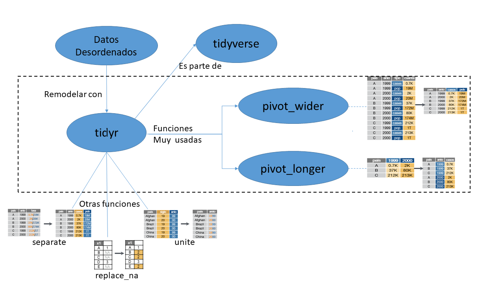

<style type="text/css">
  body{
  font-size: 12pt;
}
</style>

```{r setup, include=FALSE}
library(tidyverse)
library(datos)
library(kableExtra)
```

# LEARNER PERSONA:  Ana López


## Antecedentes generales (_General background_):

Ana es una estudiante de Biología, está en 4to año de la carrera, y ama a los animales. 
Su padre es veterinario, y tiene un negocio para mascotas. Por eso Ana desde chica estuvo en contacto con animales. Le gustan mucho los pájaros, con sus colores y su canto. Vive muy lejos de la universidad, pero tiene tantas ganas de aprender que nunca falta a sus clases, salvo algún caso de fuerza mayor. 


## Conocimientos anteriores (_Relevant Experience_):

Desde la secundaria, en sus clases de computación, aprendió a usar Excel, y para ayudar a su padre con la administración del negocio, armaba planillas de cálculo con algunas fórmulas sencillas. Desde ese momento está muy entusiasmada en utilizar la computadora como ayuda en la facultad y  en el trabajo de su padre.  
En la facultad, se anotó en un taller de introducción a R y tuvo algunas clases de R base de nivel inicial.   

## Necesidades que percibe (_Perceived Needs_):
En la facultad tuvo como docente a un Doctor en Biología, investigador en el Conicet (Consejo Nacional de Investigaciones Científicas y Técnicas), que la incentivó para incursionar en la Ciencia de datos para aprender a generar modelos y realizar predicciones. Como el curso de R era sólo teórico,  no tuvo prácticas y le pareció muy difícil programar. Le sugirieron que Tidyverse era más fácil de aprender, y que tenía lindas visualizaciones, podía generar reportes rápidamente y con buena estética para una tesis.
Ana esta muy interesada en aprender R y quiere usarlo como una herramienta para cuando tenga que hacer su tesis. Quizá también pueda ayudar a su padre a crecer en su negocio... 


## Consideraciones Especiales (_Special considerations_)
Ana es muy dulce, pero tímida y habla muy poco en clase. Tiene problemas en la vista, y trata de sentarse siempre en los primeros asientos. Le cuesta sociabilizar con sus compañeros.
Al vivir lejos frecuentemente llega muy apurada y no logra concentrarse demasiado al principio de la clase.


# Mapa Conceptual (_Conceptual Map_)



# Formative Assessments:


*En los ejercicios usaremos las tablas del paquete(datos)*

## EJERCICIO 1. Usando la tabla4a del paquete datos: 

*CANTIDAD DE CASOS POR PAIS Y AÑO*
```{r ejercicio1, echo = FALSE}
kable(tabla4a) %>% 
  kable_styling(bootstrap_options = "striped", full_width = FALSE, position = "left")
```
Esta tabla tiene 3 columnas: 
pais, 1999, 2000  
Cuáles son las variables presentes en esta tabla?   
Elige una opción:    
1. país, año, casos  
2. país, 1999, 2000  
3. Afganistan, Brasil, China  
4. país, año  


### SOLUCION: 1.país, año, casos


## EJERCICIO 2. Utilizando la tabla del ejercicio anterior 
```{r ejercicio2, echo = FALSE}
kable(tabla4a) %>% 
  kable_styling(bootstrap_options = "striped", full_width = FALSE, position = "left")
```
Tenemos que crear las columnas anio y casos en lugar de 1999 y 2000.
Completar los huecos de la siguiente instrucción pivot_longer.

_____ %>% 
  pivot_longer(c("1999", "2000"), names_to = "_____", values_to = "_____")


### SOLUCION:
```{r ejercicio2_sol, echo = TRUE, eval = FALSE}
tabla4a %>% 
  pivot_longer(c("1999", "2000"), names_to = "anio", values_to = "casos")
```


## EJERCICIO 3. Utilizando la tabla2:  
```{r echo = FALSE}
kable(tabla2) %>% 
  kable_styling(bootstrap_options = "striped", full_width = FALSE, position = "left")
```
Tenemos que :

  1. Crear una **tabla2_nueva** 

  2. utilizando la **tabla2** 

  3. agregar columnas **poblacion** y **casos** 

  4. Llevar la información de la columna **cuenta** a la columna que corresponda (según la columna **tipo**)

Ordená las siguientes partes para obtener la función completa como corresponde: 

pivot_wider( 

tabla2 %>% 

tabla2_nueva <- 

tipo, 

names_from = 

values_from = 

cuenta)

### SOLUCION

```{r pivot_wider, echo=TRUE}
tabla2_nueva <- tabla2 %>% 
  pivot_wider(names_from = tipo, values_from = cuenta)
  
```